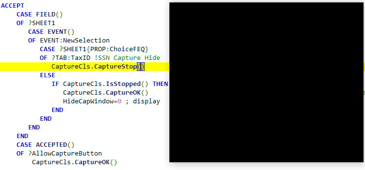
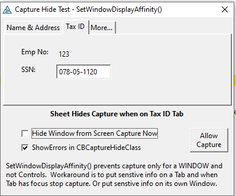

# CaptureHide Class
 Screen Capture Stop

The CBCaptureHide class calls Windows [SetWindowDisplayAffinity](https://docs.microsoft.com/en-us/windows/win32/api/winuser/nf-winuser-setwindowdisplayaffinity) function to set to "Monitor Only". Any attempt at screen capture will show a black window. This works for Print Screen and various screen snipping tools.
The API only works with top-level windows. You cannot set it for individual controls. A workaround is to put sensitive information on a specific Tab, then when that Tab takes focus stop capture. 
The included example below shows a screen capture with the Tax ID tab active

The Allow Capture button shows monitor view of the tab.

## Requirements
SetWindowDisplayAffinity() is available under Windows 7 and newer. The class dynamically loads User32.DLL and does GetProcAddress(). If run under Vista or XP the program will load and run fine, it will not prevent capture.

## MDI Issues

Preventing capture on an MDI child window fails. The SetWindowDisplayAffinity() must be done on the MDI Frame. I modified the Class to add MDI methods that find the Frame (GetAncestor Root). I uploaded a Frame test project CapHideMdiTest.cwproj and it all works. 

I have not implemented this in live code. If I did I would probably implement it all in the Frame and Post events for Capture Hide / Capture OK. The example is simple and hides the frame from the Client 1 procedure. This does work fine if you have just one window to protect.

## TeamViewer Issues

I was remoted in using TeamViewer. As soon as I turned on Capture Stop the frame window turned all black for me remotely. The local user could still see the window fine. I read online that Remote Desktop does not have this issue.

So it seems this Capture Hide will NOT be useful.